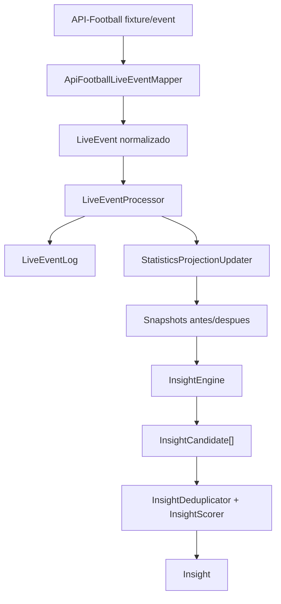

# World Cup 2026 Insight Engine - Arquitectura

Este backend esta orientado a generar historias historicas a partir de eventos vivos del Mundial 2026.
No es una app de livescore: API-Football solo entra como fuente live, mientras que la historia local es la fuente de verdad.

## Capas principales

### Historical core

Contiene hechos historicos importados desde `datasets` o desde seeds:

- `WorldCup`
- `TournamentStage`
- `Team`
- `Player`
- `Match`
- `Goal`
- `Card`
- `Substitution`
- `PenaltyKick`
- `SquadMember`
- `PlayerAppearance`
- `TeamAppearance`
- `GroupStanding`
- `TournamentStanding`

Estas tablas deben representar hechos. No deben responder preguntas complejas por si solas.

### Statistics projections

Tablas derivadas y regenerables:

- `PlayerStats`
- `PlayerOpponentStats`
- `TeamStats`
- `TeamOpponentStats`
- `RecordBookEntry`
- `MatchStateSnapshot`

Estas proyecciones estan optimizadas para responder preguntas frecuentes del motor de insights:

- cuantos goles tiene un jugador
- cuantos goles tiene ante un rival
- cuantos goles historicos tiene una seleccion
- historial directo entre dos selecciones
- records actuales

La regla es importante: una proyeccion puede actualizarse incrementalmente durante el vivo, pero tambien debe poder reconstruirse desde cero desde los hechos historicos.

### Live ingestion

API-Football se adapta mediante:

- `ApiFootballClient`
- `ApiFootballLiveEventMapper`
- `ExternalIdMappingResolver`
- `ExternalIdMapping`

Los IDs externos nunca deben entrar directamente al dominio. Antes se traducen a IDs locales (`T-28`, `P-09831`, `M-1930-01`, etc.).

### Event processing

El flujo central esta en `LiveEventProcessor`:

1. Recibe un `LiveEvent` normalizado.
2. Busca si ya fue procesado en `LiveEventLog`.
3. Guarda el evento con estado `pending`.
4. Actualiza proyecciones estadisticas.
5. Ejecuta reglas de insight.
6. Persiste insights no duplicados.
7. Marca el evento como `processed`.

Esto da idempotencia frente al polling de API-Football.

### Insight engine

El motor vive alrededor de:

- `InsightEngine`
- `InsightRule`
- `InsightCandidate`
- `InsightScorer`
- `InsightDeduplicator`
- `InsightPersistenceService`

Las reglas iniciales son:

- `FirstWorldCupGoalRule`
- `FirstGoalVsOpponentRule`
- `TeamFirstGoalVsOpponentRule`
- `TeamGoalMilestoneRule`

Cada regla recibe un evento y snapshots estadisticos antes/despues. No consulta toda la historia ni depende de DTOs externos.

## Flujo de un gol



## Comandos utiles

Compilar:

```bash
pnpm.cmd build
```

Importar la base historica desde `datasets` y los CSV semilla de goles/jugadores:

```bash
pnpm.cmd historical:import
```

Reconstruir estadisticas desde la base historica cargada:

```bash
pnpm.cmd stats:rebuild
```

Sincronizar un fixture live de API-Football:

```http
POST /api/live/api-football/fixtures/:fixtureId/sync
```

Consultar insights:

```http
GET /api/insights?status=candidate&limit=50
```

## Siguiente bloque recomendado

El importador historico ya carga:

- `tournaments.csv` -> `WorldCup`
- `tournament_stages.csv` -> `TournamentStage`
- `team_appearances.csv` -> `TeamAppearance`
- `player_appearances.csv` -> `PlayerAppearance`
- `bookings.csv` -> `Card`
- `substitutions.csv` -> `Substitution`
- `penalty_kicks.csv` -> `PenaltyKick`
- `squads (convocados por equipo).csv` -> `SquadMember`
- `group_standings...csv` -> `GroupStanding`
- `tournament_standings.csv` -> `TournamentStanding`
- `matches.csv` -> `Match`
- `teams (solo paises).csv` -> `Team`
- `src/seeds/players/players.csv` -> `Player`
- `src/seeds/goals/goals.csv` -> `Goal`

Al terminar, ejecuta automaticamente la reconstruccion de estadisticas.
